  

  

  
  
  

---

<h2 align="center">👨‍💻 About Me</h2>

💡 Senior <b>full-stack</b> and <b>Flutter</b> engineer, shipping web and mobile products since 2016  
✨ I run <a href="https://thecodecrunch.com">The Code Crunch</a>, a small studio building for clients in the US and UK

<table>
  <tr>
    <td>🚀</td>
    <td><b>Working on</b></td>
    <td><a href="https://uptick.social">Uptick</a>, social investing for retail traders</td>
  </tr>
  <tr>
    <td>🛠️</td>
    <td><b>I build</b></td>
    <td>Web apps, Flutter mobile apps, and the servers behind them</td>
  </tr>
  <tr>
    <td>🔐</td>
    <td><b>Also into</b></td>
    <td>Mobile app security testing</td>
  </tr>
  <tr>
    <td>📬</td>
    <td><b>Contact</b></td>
    <td><a href="mailto:hi@rajnish.dev">hi@rajnish.dev</a></td>
  </tr>
  <tr>
    <td>🌐</td>
    <td><b>Portfolio</b></td>
    <td><a href="https://rajnish.dev">rajnish.dev</a></td>
  </tr>
</table>

 

<table>
<tr>
<td width="50%" valign="top">

### 🎯 What I Do

- 🏗️ Build **full-stack web apps** end to end
- 📱 Ship **Flutter apps** for iOS and Android
- 🖥️ Run the **Linux servers** behind them
- 🔐 Test **mobile apps** for security holes

</td>
<td width="50%" valign="top">

### 🧭 How I Work

- 🤝 Client relationships that run for **years**, not projects
- 🧱 One engineer from **first architecture call** to long after launch
- 📐 **Clean architecture** and honest estimates
- 🌍 **Remote**, with clients in the US and UK

</td>
</tr>
</table>

---

<h2 align="center">🛠️ Tech Stack</h2>

### Frontend

    

### Backend

     

### Mobile

  

### Ops & Security

    

  

---

<h2 align="center">🚀 Featured Work</h2>

<table>
<tr>
<td width="50%" valign="top">

### 📈 [Uptick](https://uptick.social)
> Social investing platform for retail traders. I work across the Flutter app, the React desktop app and the Node.js backend.

`Flutter` `React` `Node.js`

 

### 🎁 [PerkZilla](https://perkzilla.com)
> Growth-marketing SaaS for referrals, contests and waitlists. Full-stack work on the campaign builder, dashboards and analytics.

`SaaS` `Full-stack`

</td>
<td width="50%" valign="top">

### 🧭 [Russell Coaching](https://russellcoaching.com)
> Website for a US coaching practice, designed and built end to end, with a CMS the team runs without a developer.

`Laravel` `Tailwind CSS` `Filament`

 

### 🏡 [Vyta](https://hellovyta.com)
> In-home care and rides for older adults. Booking, scheduling, estimates and reminders across web and mobile.

`Flutter` `Laravel`

</td>
</tr>
</table>

---

<h2 align="center">🔐 Security Tools</h2>

---

<h2 align="center">📊 GitHub Activity</h2>

<picture>
  <source media="(prefers-color-scheme: dark)" srcset="https://streak-stats.demolab.com/?user=rakhaxor&disable_animations=true&background=00000000&ring=38bdf8&fire=38bdf8&currStreakNum=ffffff&sideNums=ffffff&currStreakLabel=38bdf8&sideLabels=c9d1d9&dates=8b949e&stroke=30363d&border=30363d">
  
</picture>

---

<h2 align="center">🤝 Let's Connect</h2>

Email is the fastest way to reach me.

  
  
  

<h3 align="center">🚀 Building, shipping, and breaking things on purpose.</h3>

